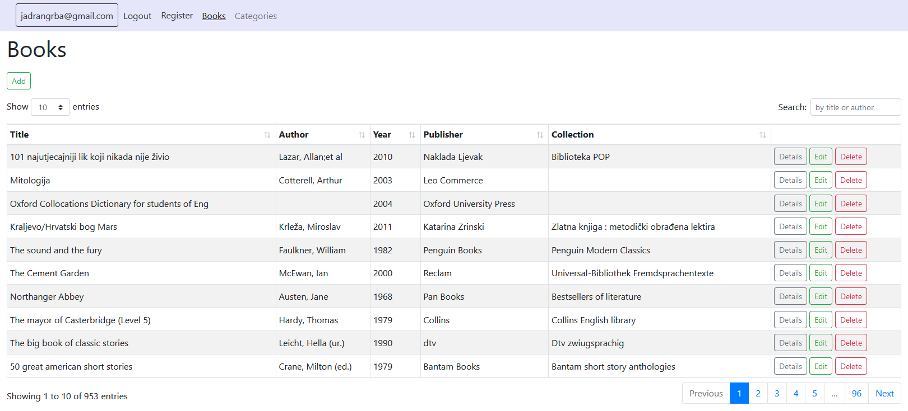

Short overview:
===============

What is this?
-------------

Very simple book catalog Asp.net MVC web application I created for the purpose of exercise. 

What is utilized?
-------------------

* .NET 5.0
* MS SQL Server 2019
* Entity framework 5
* ASP.NET Identity
* DataTables (jQuery plug-in)
  * Responsive extension for DataTables
* Server-side paging, sorting and searching
* Twitter-bootstrap 4
* Serilog
*	Xunit

How to run?
-----------

*	Clone or download code
*	Open solution (Visual studio 2019 or later)
*	Project "BookCatalog.Web" => set as startup project
*	Right click on the solution => "restore client-side libraries"
*	Run the app ("play" icon from upper menu)
*	When app starts, database is created (migrated is executed) with few tables
*	The database is empty at the moment
*	Open the database and execute the sql script from the folder "doc => updateDatabase.sql"
* Username and password for the app:
  * username: "octopus@yahoo.com"
  * password: "2xSNzSa$"

## Work in progress...

- Add custom configuration provider to encrypt  the connection string
- Create partial view to share same html between "Create" and "Edit" views.
  - The point is to reduce unneeded code repetition
- Create partial view to share same html between "Details" and "Delete" views.
  - The point is we reduce unneeded code repetition
- Add "Result Pattern", a layer between service and controller which contains the logic of determining if result is eg. "Ok", "Invalid", "Unauthorized" etc. 
  - The point is to remove that logic from controller.
  - https://alexdunn.org/2019/02/25/clean-up-your-client-to-business-logic-relationship-with-a-result-pattern-c/
- There is only few unit tests for now. More unit and integration tests could be added.
- Account management module is not finished completely. 
  - Forgot password is not working
  - Email confirmation is disabled because I didn't setup smtp yet.
